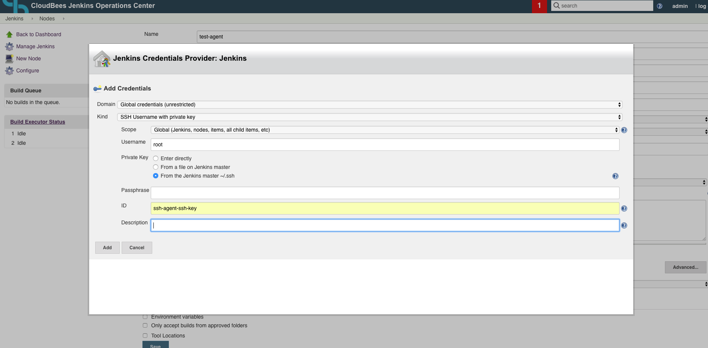
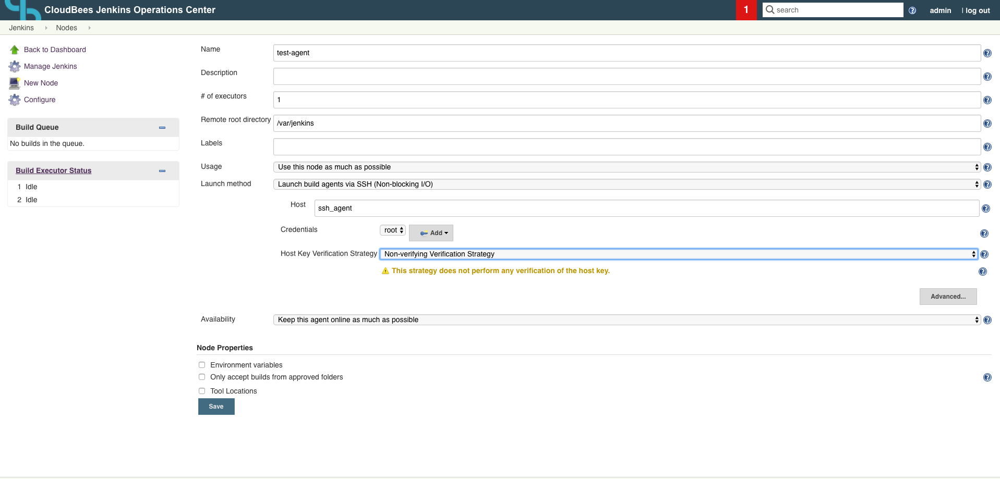

# For testing different things related to SSH agent setup/connectivity

1. From this directory run `docker-compose up --build`
2. Access CJOC via http://[your docker machine ip]:8080, and go through the set up
3. Manage Jenkins -> Manage Nodes and create a permanent agent:

